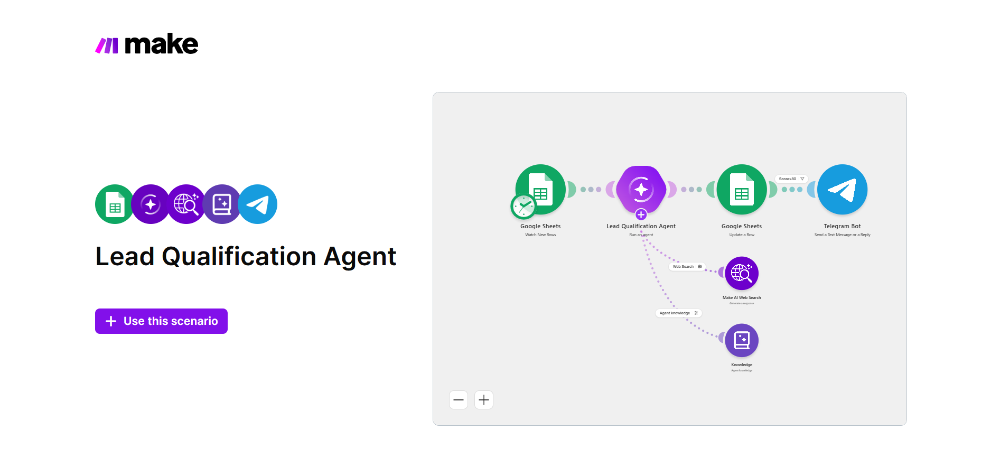

# AI Lead Qualification Agent

A Make.com automation that qualifies incoming leads, enriches lead data, updates records, and notifies the sales team for faster follow-up.

## Business Problem

Sales teams often receive leads with different levels of quality and intent. Manually reviewing every lead takes time and can delay follow-up.

## Solution

This workflow automates the qualification process by collecting incoming lead data, evaluating the lead with AI, enriching the available information, updating the lead record, and sending the result through Telegram.

## Workflow

1. Watch for new leads in Google Sheets
2. Evaluate the lead using an AI agent
3. Use web search and connected knowledge when needed
4. Update the lead record with the qualification result
5. Send the result to Telegram for follow-up

## Business Area

**Sales Automation**

## Tools & Technologies

- Make.com
- Google Sheets
- AI Agent
- Web Search
- Knowledge Base
- Telegram Bot

## Key Automation Concepts

- Lead qualification
- AI-assisted decision making
- Data enrichment
- Conditional workflow logic
- Record updates
- Automated notifications

## Outcome

The workflow reduces manual lead review and helps sales teams identify and follow up with qualified leads faster.

## Full Project Repository

[Open Full Project Repository](https://github.com/ThecrashO/make-lead-qualification-agent/)
