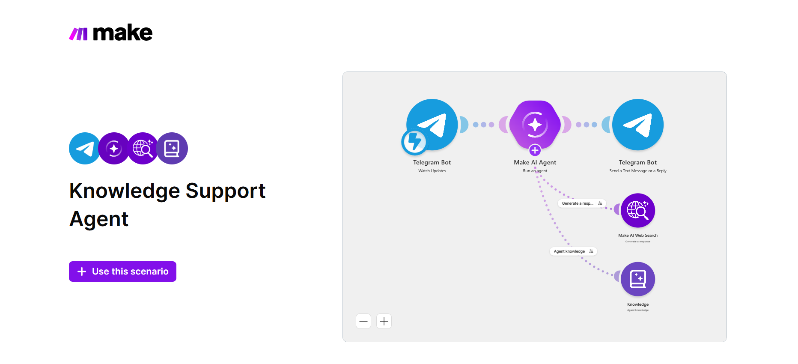

# AI Knowledge Support Agent

A Make.com automation that uses AI and a connected knowledge source to provide fast, consistent answers to user questions.

## Business Problem

Support teams often answer the same questions repeatedly. This creates unnecessary manual work and slows down response time.

## Solution

This automation receives a user question, retrieves relevant information from a connected knowledge source, generates a response, and sends the answer back automatically.

## Workflow

1. Receive a user question
2. Search or retrieve relevant knowledge
3. Send the context to an AI model
4. Generate a response
5. Return the answer to the user

## Business Area

**Customer Support Automation**

## Tools & Technologies

- Make.com
- AI / LLM
- Knowledge Base
- APIs
- Messaging / notification tools

## Key Automation Concepts

- Knowledge retrieval
- AI-assisted responses
- Workflow orchestration
- Automated support
- Data passing between services

## Full Project Repository

[Open Full Project Repository](https://github.com/ThecrashO/make-knowledge-support-agent)

## Screenshots

