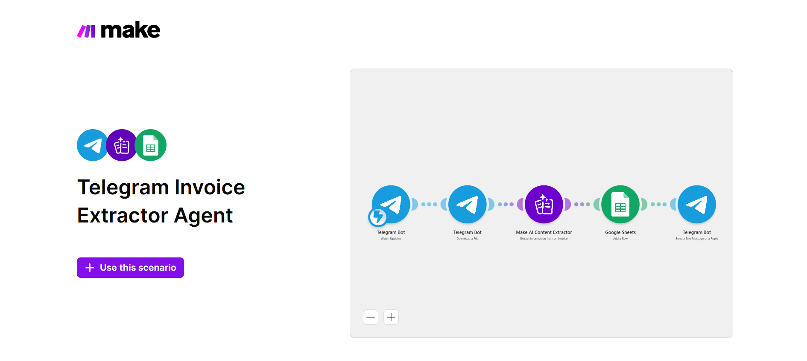

# AI Telegram Invoice Extractor

A Make.com automation that receives invoices through Telegram, extracts key invoice information with AI, and converts it into structured business data.

## Business Problem

Manually reading invoices and entering details into spreadsheets or business systems is repetitive, time-consuming, and prone to human error.

## Solution

This automation allows users to send invoice files through Telegram. The workflow processes the invoice, extracts important fields, structures the data, and stores or forwards the result automatically.

## Workflow

1. Receive an invoice through Telegram
2. Read or process the invoice file
3. Extract invoice information with AI
4. Convert the extracted data into a structured format
5. Store or send the processed invoice data
6. Return a confirmation or result to the user

## Business Area

**Finance / Operations Automation**

## Tools & Technologies

- Make.com
- Telegram Bot
- AI / LLM
- APIs
- Structured Data Processing

## Key Automation Concepts

- Document processing
- AI data extraction
- File handling
- Structured output
- Workflow automation
- Automated notifications

## Full Project Repository

[Open Full Project Repository](https://github.com/ThecrashO/make-telegram-invoice-extractor)

## Screenshots

