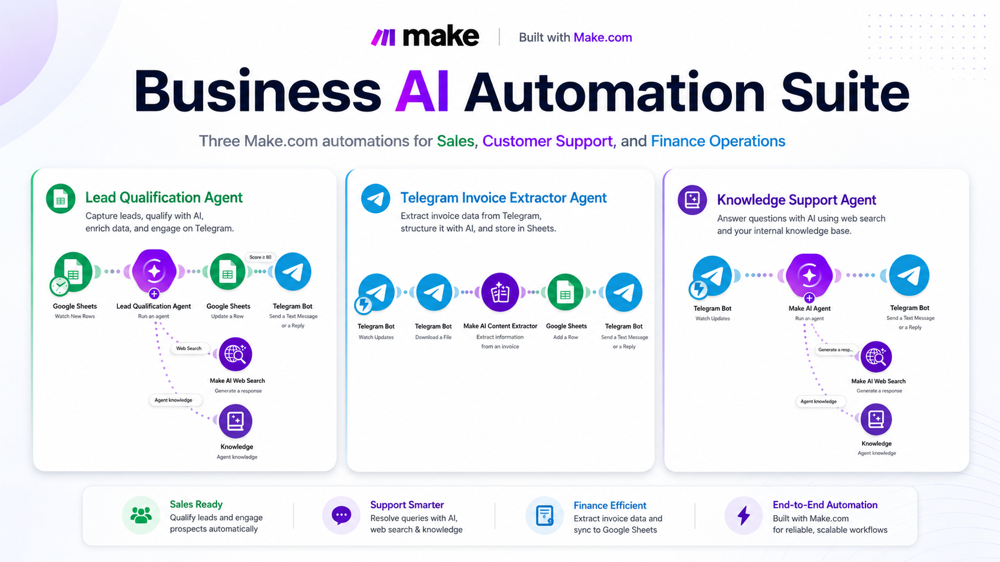

# Business AI Automation Suite

A portfolio collection of three Make.com automation projects designed for real business workflows across Sales, Customer Support, and Finance Operations.

## Projects

### 1. AI Lead Qualification Agent

An automated lead qualification workflow that evaluates incoming leads, organizes lead data, and supports faster sales follow-up.

**Business Area:** Sales Automation

[View Project](./01-lead-qualification-agent/)

---

### 2. AI Knowledge Support Agent

An AI-powered support automation designed to answer user questions using a connected knowledge source.

**Business Area:** Customer Support Automation

[View Project](./02-knowledge-support-agent/)

---

### 3. AI Telegram Invoice Extractor

A Telegram-based automation that extracts invoice information and converts it into structured business data.

**Business Area:** Finance / Operations Automation

[View Project](./03-telegram-invoice-extractor/)

---

## Business Coverage

| Project | Business Area | Main Purpose |
|---|---|---|
| AI Lead Qualification Agent | Sales | Lead qualification and follow-up support |
| AI Knowledge Support Agent | Customer Support | Automated knowledge-based assistance |
| AI Telegram Invoice Extractor | Finance / Operations | Invoice data extraction and processing |

## Tools & Technologies

- Make.com
- AI / LLM
- Telegram
- Google Sheets
- APIs
- Knowledge Base Integration

## Portfolio Goal

This suite demonstrates how Make.com can be used to automate different business functions with practical workflows, AI integrations, data processing, and notifications.
